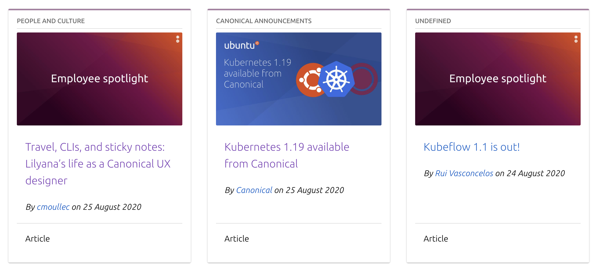

# Canonical-Project

## Code Structure:
* Index.html: It is the web page that shows the card designs when opened via the browser. It uses vanilla framework for styling.
* App.js: It contains code to fetch data from the API and render the content in the format specified.

### Output 

